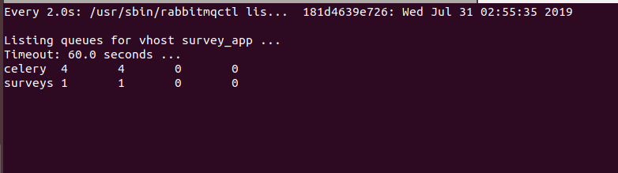

## Basic Survey App ( Using Django, Mysql, RabbitMQ, Redis & Docker-compose )

**App Idea:**
1. The app allows the admin to enter survey questions with multiple choice answers.

2. When a guest visits the app in a browser, it presents a random survey question to the guest and allow them to answer.

3. Record answers and display the survey in charts for logged in users results in an admin interface.

4. The app avoids showing a previously answered question to the same guest.

## Run Instruction:

```
docker-compose up
```

Utilizes 5 containers:

* Django-App
* MySQL
* Redis
* RabbitMQ
* Celery


## ETL: Loading Data

```
python manage.py load_surveys_data

```

## Running Tests


```
python manage.py test --settings=settings.test

```


## To Watch RabbitMQ Queues ##

```
docker exec -it survey-rabbitmq sh /var/lib/rabbitmq/watch-rabbitmq.sh
```




